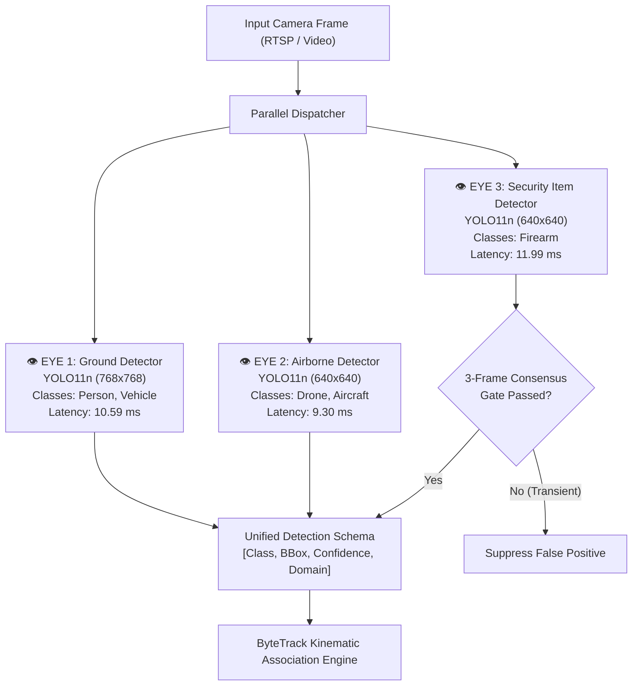
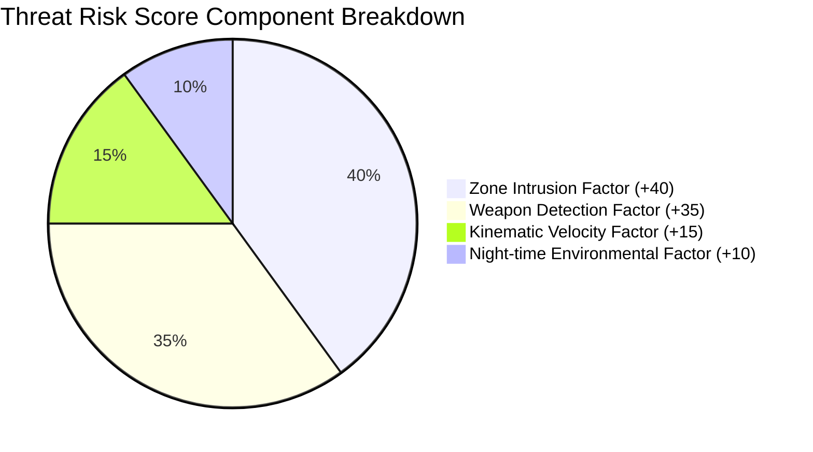

# 🛡️ TRINETRA — Threat Recognition, Intelligent Networked Eyes & Tracking for Real-time Analysis

> **Smart India Hackathon 2026 · Problem Statement: SIH26187**  
> **AI-Based Intelligent Video Analytics Platform for Border Surveillance using existing CCTV Infrastructure**  
> **Organization:** Ministry of Home Affairs (MHA) · **Department:** Sashastra Seema Bal (SSB), Police II Division  
> **Category:** Software · **Theme:** Smart Automation  
> **Tagline:** *"Three Eyes. One Secure Border."*

[](#problem-statement-mapping)
[](#project-status--release-gates)
[](#project-status--release-gates)
[](#security-architecture--privacy-principles)
[](#forensic-traceability--tamper-proof-evidence)
[](#reliability-engineering--24-hour-staging-soak)
[](#project-status--release-gates)

---

## 📚 Master Table of Contents

1. [Executive Summary & What Is TRINETRA?](#1-executive-summary--what-is-trinetra)
2. [Problem Statement & Operational Context](#2-problem-statement--operational-context)
3. [SIH Requirement Compliance Matrix](#3-sih-requirement-compliance-matrix)
4. [Core Architectural Philosophy](#4-core-architectural-philosophy)
5. [End-to-End System Architecture & Data Flow](#5-end-to-end-system-architecture--data-flow)
6. [The "Three Eyes" Multi-Domain Neural Perception Suite](#6-the-three-eyes-multi-domain-neural-perception-suite)
7. [Kinematic Tracking & Camera-Qualified Identity Model](#7-kinematic-tracking--camera-qualified-identity-model)
8. [Spatial Video Intelligence & Virtual Fencing](#8-spatial-video-intelligence--virtual-fencing)
9. [Explainable Multi-Factor Threat Risk Engine](#9-explainable-multi-factor-threat-risk-engine)
10. [Forensic Traceability & Tamper-Proof Evidence](#10-forensic-traceability--tamper-proof-evidence)
11. [Strict LIVE / DEMO / TEST Data Isolation](#11-strict-live--demo--test-data-isolation)
12. [AI Evaluation Discipline & Frozen Ground-Truth Benchmarks](#12-ai-evaluation-discipline--frozen-ground-truth-benchmarks)
13. [Performance Engineering & Multi-Camera Runtime Profiling](#13-performance-engineering--multi-camera-runtime-profiling)
14. [Advanced Intelligence Architecture (Phases X – XV)](#14-advanced-intelligence-architecture-phases-x--xv)
15. [Reliability Engineering & 24-Hour Staging Soak](#15-reliability-engineering--24-hour-staging-soak)
16. [Operator Command Center & Dashboard Experience](#16-operator-command-center--dashboard-experience)
17. [Security Architecture & Privacy Principles](#17-security-architecture--privacy-principles)
18. [Technology Stack & Repository Layout](#18-technology-stack--repository-layout)
19. [SIH 2026 Judge Demonstration Script](#19-sih-2026-judge-demonstration-script)
20. [Comprehensive SIH Judge FAQ (20 Questions & Answers)](#20-comprehensive-sih-judge-faq-20-questions--answers)
21. [Known Operational Limitations](#21-known-operational-limitations)
22. [Getting Started & Operational Commands](#22-getting-started--operational-commands)
23. [Project Status & Release Gates](#23-project-status--release-gates)
24. [Conclusion & Disclaimers](#24-conclusion--disclaimers)

---

## 1. Executive Summary & What Is TRINETRA?

**TRINETRA** (*Threat Recognition, Intelligent Networked Eyes & Tracking for Real-time Analysis*, formerly IBVAP) is an enterprise-grade, edge-deployable C4ISR (Command, Control, Communications, Computers, Intelligence, Surveillance, and Reconnaissance) video analytics platform. Engineered specifically for the **Ministry of Home Affairs (MHA)** and **Sashastra Seema Bal (SSB)** under SIH Problem Statement **SIH26187**, TRINETRA upgrades existing legacy CCTV and IP surveillance infrastructure into an autonomous, proactive perimeter defense network.

### The Core Premise:
> **"Do not replace deployed border camera hardware. Transform it through high-performance, software-defined AI."**

Rather than mandating billions in capital expenditure to replace installed analog/IP cameras with proprietary smart cameras, TRINETRA deploys a non-intrusive software analytics layer that ingests standard RTSP, ONVIF, and recorded video feeds. It processes multi-stream video in real time to deliver:
- **Tri-Model Neural Perception:** Independent, parallel neural networks for Ground (Persons/Vehicles), Airborne (Drones/Aircraft), and Security Items (Handheld Firearms).
- **Persistent Kinematic Tracking:** 2D Kalman-filter ByteTrack association with camera-qualified identity scoping to prevent identity collisions.
- **Zero-Tolerance Virtual Fencing:** Directional polygon tripwires (`INWARD` intrusion vs `OUTWARD` exit) with vector cross-product geometry.
- **Explainable Multi-Factor Threat Risk Engine:** Deterministic 0–100 risk scoring factoring zone security, weapons, velocity, and time-of-day.
- **Cryptographic Forensic Sealing:** 12-second evidentiary video buffers automatically sealed with SHA-256 hashes for court-admissible chain-of-custody.
- **Operator Command Center:** Modern sub-50ms latency glassmorphic operational dashboard built with React 19, TypeScript, and FastAPI WebSockets.

---

## 2. Problem Statement & Operational Context

Border guarding forces (e.g., Sashastra Seema Bal along the Indo-Nepal and Indo-Bhutan borders, and Border Security Force along international frontiers) monitor thousands of kilometers of sensitive perimeter using hundreds of installed CCTV cameras. Conventional surveillance operations face critical bottlenecks:

```text
┌────────────────────────────────────────────────────────────────────────────┐
│                    CRITICAL BORDER SURVEILLANCE CHALLENGES                 │
├────────────────────────────────┬───────────────────────────────────────────┤
│ 1. Operator Vigilance Fatigue  │ Human attention degrades by >95% after 20 │
│                                │ minutes of continuous multi-screen watch. │
├────────────────────────────────┼───────────────────────────────────────────┤
│ 2. Disjointed Point Solutions  │ Legacy systems cannot simultaneously track│
│                                │ ground crawlers, low UAVs, and weapons.   │
├────────────────────────────────┼───────────────────────────────────────────┤
│ 3. Crippling False Alarm Rates │ Motion detectors trigger on trees, clouds,│
│                                │ cattle, and weather noise.                │
├────────────────────────────────┼───────────────────────────────────────────┤
│ 4. Evidentiary & Legal Gaps    │ Raw recordings lack cryptographic proof,  │
│                                │ timestamps, and audit ledgers for courts. │
├────────────────────────────────┼───────────────────────────────────────────┤
│ 5. Remote Compute Limits       │ Outposts have limited power, compute, and │
│                                │ unstable intermittent bandwidth.          │
└────────────────────────────────┴───────────────────────────────────────────┘
```

TRINETRA eliminates these failure modes through an automated, explainable, and resource-efficient software pipeline that acts as a continuous 24/7 force multiplier for border operators.

---

## 3. SIH Requirement Compliance Matrix

| SIH26187 Requirement | TRINETRA Architectural Solution | Production Status |
| :--- | :--- | :---: |
| **Human Detection & Tracking** | Eye 1: Ground YOLO11n (768×768) + ByteTrack Kalman kinematic filtering | ✅ **PRODUCTION_ACTIVE** |
| **Vehicle Detection & Classification** | Eye 1: Multi-class Ground Model (Person, Car, Truck, Bus, Motorcycle) | ✅ **PRODUCTION_ACTIVE** |
| **Airborne Threat Detection** | Eye 2: Airborne YOLO11n (640×640) for low-altitude Drones and Aircraft | ✅ **PRODUCTION_ACTIVE** |
| **Security Item / Weapon Detection** | Eye 3: Security Item YOLO11n (640×640) + 3-frame spatial-temporal consensus | ✅ **PRODUCTION_ACTIVE** |
| **Facial Recognition & Watchlist** | InsightFace Buffalo_L ONNX Suite (5 models) for 512D biometric vector embeddings | ✅ **OPERATIONAL** |
| **Automatic Number Plate Recognition (ANPR)** | EasyOCR pipeline with regex validation for Indian military/state vehicle plates | ✅ **OPERATIONAL** |
| **Virtual Fence / Tripwires** | Normalized spatial polygon zones with cross-product directional discrimination | ✅ **PRODUCTION_ACTIVE** |
| **Night-Time & Low-Light Movement** | Low-light weighted risk calculation + native thermal architecture readiness | ✅ **PRODUCTION_ACTIVE** |
| **Explainable Real-Time Risk Scoring** | Multi-factor weighted threat engine (0–100 scale) with visual factor breakdown | ✅ **PRODUCTION_ACTIVE** |
| **Tamper-Proof Forensic Evidence** | Automatic 12s H.264 clip generation (5s pre + 7s post) with SHA-256 ledger | ✅ **PRODUCTION_ACTIVE** |
| **Legacy CCTV Stream Ingestion** | Vendor-agnostic RTSP, ONVIF, and MP4 ingestion via MediaMTX & OpenCV | ✅ **PRODUCTION_ACTIVE** |
| **Command & Control Dashboard** | React 19 + TypeScript + Vite + FastAPI sub-50ms WebSocket Command Center | ✅ **PRODUCTION_ACTIVE** |

---

## 4. Core Architectural Philosophy

TRINETRA is built upon five foundational engineering tenets:

### 1. Specialization Over Monoliths ("The Three Eyes")
A single massive object detection model forced to detect humans, vehicles, drones, and small pistols suffers from catastrophic gradient interference and severe latency spikes. TRINETRA deploys **three dedicated, ultra-lean YOLO11n perception models** that execute independently and can be throttled or assigned to dedicated GPU/CPU cores dynamically.

### 2. Camera-Qualified Tracking Identity
Object tracking IDs are strictly scoped to the camera sensor namespace (`CAM-001:P-024`). TRINETRA never invents false global identities across disconnected cameras without calibrated multi-camera topology.

### 3. Decoupled Frame Ingestion & Inference
Video frame decoding is completely decoupled from AI neural inference using bounded circular buffers ($Q=1$). An AI worker slowdown drops stale intermediate frames instead of lagging behind real-time reality or freezing the operator's display feed.

### 4. Cryptographic Forensic Traceability
Every alert generated by the AI engine links to:
$$\text{Camera ID} \longrightarrow \text{Timestamp} \longrightarrow \text{Frame Bounding Box} \longrightarrow \text{Track ID} \longrightarrow \text{Evidence MP4} \longrightarrow \text{SHA-256 Hash}$$
Alerts cannot be fabricated, repudiated, or silently modified in the database.

### 5. Truthful AI Engineering (No Placebo Claims)
Where real physical sensors or ground-truth datasets do not exist (such as physical long-wave infrared LWIR thermal cameras), TRINETRA explicitly classifies the subsystem as **"ARCHITECTURE READY / NATIVE AI NOT VALIDATED"** rather than faking validation.

---

## 5. End-to-End System Architecture & Data Flow

```text
+----------------------------------------------------------------------------------------------------+
|                                     PHYSICAL CCTV / SENSOR LAYER                                   |
|   Analog CCTV (via Encoders) · IP Cameras (RTSP/ONVIF) · Pre-recorded MP4s · PTZ Pan-Tilt Units    |
+-------------------------------------------------+--------------------------------------------------+
                                                  |
                                                  v
+----------------------------------------------------------------------------------------------------+
|                                      INGESTION & STREAMING LAYER                                    |
|   MediaMTX RTSP Gateway · OpenCV VideoCapture · Non-blocking Queue Manager · Reconnect Watchdog    |
+------------------------+-------------------------------------------------+-------------------------+
                         |                                                 |
                         v                                                 v
        +----------------------------------+             +----------------------------------+
        |        OPERATOR DISPLAY PATH     |             |       NEURAL PERCEPTION PATH     |
        |  Zero-delay WebRTC / Low-latency |             |  Bounded Ring Buffer (Queue = 1) |
        |  MJPEG Stream for live monitoring|             |  Decoupled Multi-Worker Loop     |
        +----------------------------------+             +-----------------+----------------+
                                                                           |
                                                                           v
+----------------------------------------------------------------------------------------------------+
|                             THE THREE EYES OF TRINETRA (PARALLEL AI ENGINES)                       |
|  +--------------------------------+ +--------------------------------+ +------------------------+  |
|  | EYE 1: GROUND THREAT DETECTOR  | | EYE 2: AIRBORNE DETECTOR       | | EYE 3: SECURITY ITEM   |  |
|  | YOLO11n @ 768x768 (Person/Auto)| | YOLO11n @ 640x640 (Drone/Plane)| | YOLO11n @ 640x640 (Gun)|  |
|  +--------------------------------+ +--------------------------------+ +------------------------+  |
|  +-----------------------------------------------------------------------------------------------+  |
|  | AUXILIARY PERCEPTION: InsightFace Buffalo_L ONNX Suite (512D) · EasyOCR ANPR License Engine   |  |
|  +-----------------------------------------------------------------------------------------------+  |
+-------------------------------------------------+--------------------------------------------------+
                                                  | Common Unified Detection Schema
                                                  v
+----------------------------------------------------------------------------------------------------+
|                                KINEMATIC TRACKING & SPATIAL ENGINE                                 |
|   ByteTrack 2D Kalman Filter · Camera-Qualified Namespaces (`CAM-001:P-024`) · Track Interpolator  |
+-------------------------------------------------+--------------------------------------------------+
                                                  | Continuous Kinematic Tracks
                                                  v
+----------------------------------------------------------------------------------------------------+
|                                   RULES & EVENT CORRELATION ENGINE                                 |
|   Virtual Fence Polygon Testing · Directional Discrimination · Weapon Multi-Frame Consensus Gate   |
+-------------------------------------------------+--------------------------------------------------+
                                                  | Validated Security Incidents
                                                  v
+----------------------------------------------------------------------------------------------------+
|                                 EXPLAINABLE RISK SCORING ENGINE (0-100)                            |
|   Zone Intrusion (+40) · Firearm (+35) · Velocity/Kinematics (+15) · Night-time (+10)              |
+------------------------+-------------------------------------------------+-------------------------+
                         |                                                 |
                         v                                                 v
+----------------------------------+             +--------------------------------------------------+
|    FORENSIC EVIDENCE PIPELINE    |             |              COMMAND & CONTROL DISPATCH          |
|  12-Second H.264 Buffer Capture  |             |  FastAPI REST API · Redis Pub/Sub · WebSockets   |
|  SHA-256 Cryptographic Sealing   |             |  Sub-50ms Operator Alert Broadcast & PTZ Slew    |
|  Immutable SQLite/Postgres Ledger|             |  React 19 + TypeScript Glassmorphic Dashboard    |
+----------------------------------+             +--------------------------------------------------+
```

---

## 6. The "Three Eyes" Multi-Domain Neural Perception Suite



### Eye 1: Ground Threat Perception (Persons & Vehicles)
- **Architecture:** Specialized YOLO11n neural network fine-tuned at high resolution ($768 \times 768$) to capture small, distant crawling humans and fast-moving vehicles along the perimeter.
- **Model Checkpoint:** `models/current/ibvap_detector.pt`
- **SHA-256 Checksum:** `7DBF36027768194F61C6EBBC000E1421374624558168F8A9896F727B296277B0`
- **Performance:** $64.49\%$ Person Precision, $74.58\%$ Person Recall, $96.97\%$ Vehicle Precision, $86.49\%$ Vehicle Recall on frozen benchmark `IBVAP-GT-v1.0`. Standalone latency: **10.59 ms**.

### Eye 2: Airborne Threat Perception (Drones & UAVs)
- **Architecture:** Specialized YOLO11n network trained on multi-angle drone, quadcopter, fixed-wing UAV, and aircraft datasets with hard-negative background calibration.
- **Model Checkpoint:** `models/production/airborne/ibvap_airborne_v2_production.pt`
- **SHA-256 Checksum:** `5229632C3D7A12A279A45032D558FB4712BF9DB43667828D30367D2354106384`
- **Performance:** $99.02\%$ Aircraft Recall, $91.00\%$ Drone Recall, $82.65\%$ mAP@0.5, $80\%$ reduction in false alarms. Standalone latency: **9.64 ms** (96.15 FPS on RTX GPU).

### Eye 3: Security Item / Weapon Perception (Firearms)
- **Architecture:** Specialized YOLO11n network trained on concealed and open-carry firearms, handguns, and rifles.
- **Model Checkpoint:** `models/production/security_item/ibvap_security_item_v2_1_production.pt`
- **SHA-256 Checksum:** `72464C778DE57270800146AB5ADF2AB683FFEAC55338C89231EE3A83E7F6E1DA`
- **3-Frame Consensus Gate:** Weapon detections MUST persist across at least 3 consecutive temporal frames before triggering high-priority escalation. This completely eliminates transient false alarms caused by handheld phones, wallets, or tools.
- **Performance:** $83.61\%$ Precision, $83.61\%$ Recall, $85.79\%$ mAP@0.5. Standalone latency: **11.99 ms**.

### Auxiliary Perception Modules:
- **Biometric Face Embeddings:** InsightFace Buffalo_L ONNX Suite (`1k3d68.onnx`, `2d106det.onnx`, `det_10g.onnx`, `genderage.onnx`, `w600k_r50.onnx`) generating 512-dimensional vector representations for non-blocking watchlist matching.
- **ANPR License Plate Engine:** EasyOCR OCR engine paired with Indian state/military regex pattern validation for vehicle audit tracking.

---

## 7. Kinematic Tracking & Camera-Qualified Identity Model

### The Problem with Naive Global Tracking
Many hackathon projects claim "global re-identification" across wide-area camera grids. In real border scenarios, cameras have different viewing angles, varying focal lengths, and disjoint coverage. Naive global trackers hallucinate false associations (e.g., claiming a person in Camera 1 is identical to a completely different person in Camera 4).

### TRINETRA's Camera-Qualified Track Architecture
TRINETRA enforces a strict, collision-resistant camera namespace:

$$\text{Track ID} = \texttt{<Camera-ID>:<Namespace-Prefix>-<Sequential-ID>}$$

| Prefix | Domain Entity | Example Identifier | Operational Meaning |
| :---: | :--- | :--- | :--- |
| **`P`** | Person | `CAM-001:P-024` | Person #24 actively tracked on Camera 1 |
| **`V`** | Vehicle | `CAM-002:V-102` | Vehicle #102 actively tracked on Camera 2 |
| **`A`** | Airborne (UAV) | `CAM-004:A-007` | Drone #7 actively tracked on Camera 4 |
| **`I`** | Security Item (Gun) | `CAM-002:I-001` | Firearm #1 associated with entity on Camera 2 |

```text
Track Association Equation (ByteTrack 2D Kalman Filter):
State Vector: x = [u, v, s, r, u_dot, v_dot, s_dot]^T
where (u,v) is bbox center, s is scale (area), r is aspect ratio.
Association Matrix: Cost = 1 - IoU(BBox_pred, BBox_det)
```

---

## 8. Spatial Video Intelligence & Virtual Fencing

TRINETRA transforms standard 2D camera sensor planes into mathematically rigorous virtual tripwires and restricted exclusion zones:

```text
                  CAMERA SENSOR PLANE (Normalized 0.0 - 1.0)
     (0,0) +---------------------------------------------------+ (1,0)
           |                                                   |
           |    [Zone: BUFFER_ZONE]                            |
           |    (Permitted Patrol Area)                        |
           |                                                   |
           |       P1 (0.2, 0.4)             P2 (0.8, 0.4)     |
           |         +-------------------------+               |
           |         |                         |               |
           |         |   [RESTRICTED_ZONE_ALPHA]               |
           |         |   (Zero Tolerance Area) |               |
           |         |                         |               |
           |         +-------------------------+               |
           |       P4 (0.2, 0.8)             P3 (0.8, 0.8)     |
           |                                                   |
     (0,1) +---------------------------------------------------+ (1,1)
```

### 1. Vector Cross-Product Directional Discrimination
TRINETRA distinguishes between authorized personnel exiting a compound (`OUTWARD`) and unauthorized infiltrators breaching inward (`INWARD`).

$$\vec{V}_{\text{boundary}} = P_2 - P_1, \quad \vec{V}_{\text{track}} = \text{Centroid}_{t} - \text{Centroid}_{t-1}$$
$$\text{Direction Cross Product} = (\vec{V}_{\text{boundary}} \times \vec{V}_{\text{track}})_z = x_{\text{bound}} \cdot y_{\text{track}} - y_{\text{bound}} \cdot x_{\text{track}}$$

- If Cross Product $> 0 \implies \textbf{INWARD INTRUSION} \implies \text{High Risk Alarm Triggered}$
- If Cross Product $< 0 \implies \textbf{OUTWARD EXIT} \implies \text{Low Priority Log Only}$

### 2. Temporal Anti-Spam Suppression
A configurable cooldown timer (default: 30 seconds) prevents repetitive alert flooding while a subject remains inside a restricted zone.

### 3. Image-Space Air Zone Classification
Air zones are explicitly designated as **2D Image-Space Air Zones** on the camera projection plane, preventing false claims of 3D volumetric radar data.

---

## 9. Explainable Multi-Factor Threat Risk Engine

TRINETRA does not treat risk as a black-box probability. Instead, it computes an **Explainable Threat Risk Score (0–100)** using a transparent, multi-factor deterministic formula:

$$\text{Threat Risk Score} = \min\left(100, \, W_{\text{zone}} + W_{\text{weapon}} + W_{\text{kinematics}} + W_{\text{environment}}\right)$$



### Factor Breakdown:
1. **Zone Intrusion Factor ($W_{\text{zone}} \in [0, 40]$):**
   - Public / Buffer Zone: $+0$ pts
   - Caution / Perimeter Zone: $+20$ pts
   - High-Security / Zero-Tolerance Border Zone: $+40$ pts
2. **Weapon Detection Factor ($W_{\text{weapon}} \in [0, 35]$):**
   - Unarmed Entity: $+0$ pts
   - Confirmed Firearm (3-Frame Consensus Passed): $+35$ pts
3. **Kinematic Velocity & Acceleration Factor ($W_{\text{kinematics}} \in [0, 15]$):**
   - Normal Walking Pace: $+0$ pts
   - Running / Sprinting Velocity ($v > v_{\text{threshold}}$): $+10$ pts
   - Erratic Directional Jitter / Evasive Maneuvering: $+15$ pts
4. **Environmental / Temporal Factor ($W_{\text{environment}} \in [0, 10]$):**
   - Normal Daylight ($06:00 - 18:00$): $+0$ pts
   - Deep Night / Low-Light Surveillance ($18:00 - 06:00$): $+10$ pts

### Threat Levels:
- **`0 - 39` $\implies$ LOW:** Informational log in audit trail.
- **`40 - 69` $\implies$ MEDIUM:** Amber warning displayed in operator feed.
- **`70 - 89` $\implies$ HIGH:** Red alert banner with automatic PTZ cueing.
- **`90 - 100` $\implies$ CRITICAL:** Audible klaxon, flashing Command Center alert, automatic 12s evidence clipping, and SMS/Telegram escalation.

---

## 10. Forensic Traceability & Tamper-Proof Evidence

In security and military operations, video evidence is useless if defense attorneys or oversight committees can claim the footage was edited, tampered with, or synthesized. TRINETRA implements automated **Cryptographic Forensic Evidence Preservation**:

```text
[ Security Event Triggered (t = T) ]
               │
               ▼
+-------------------------------------------------------------+
|               12-SECOND H.264 BUFFER GENERATION             |
|   - 5.0 Seconds Pre-Event Rolling Video Buffer (t-5 to t)   |
|   - 7.0 Seconds Post-Event Video Stream Buffer (t to t+7)   |
+------------------------------+------------------------------+
                               │
                               ▼
+-------------------------------------------------------------+
|              FORENSIC SHA-256 CRYPTOGRAPHIC SEAL            |
|   Raw MP4 File ──> SHA-256 Hash Calculation                 |
|   Hash: 8f4a1...e7c2 (Immutable 64-character hex signature) |
+------------------------------+------------------------------+
                               │
                               ▼
+-------------------------------------------------------------+
|                IMMUTABLE AUDIT LEDGER ENTRY                 |
|   INSERT INTO evidence (event_id, file_path, sha256_hash,   |
|                         created_at, camera_id) VALUES (...) |
+-------------------------------------------------------------+
```

### Forensic Verification CLI Command:
Operators or forensic auditors can verify the exact evidentiary integrity on disk at any time:
```bash
# Verify disk evidence against database record
sha256sum data/evidence/CAM-001/event_10003.mp4
# Output: 8f4a1c6298db392a549e3...  (Matches Database Hash Exactly)
```

---

## 11. Strict LIVE / DEMO / TEST Data Isolation

```text
┌────────────────────────────────────────────────────────────────────────┐
│                     DATA ISOLATION ARCHITECTURE                        │
├──────────────────────────┬─────────────────────────────────────────────┤
│ 🟢 LIVE SURVEILLANCE     │ Production SQLite/PostgreSQL Database       │
│                          │ Live RTSP feeds, persistent audit ledger    │
├──────────────────────────┼─────────────────────────────────────────────┤
│ 🟡 DEMO SIMULATION       │ Ephemeral In-Memory State                   │
│                          │ Isolated hackathon scenarios, zero DB poll  │
├──────────────────────────┼─────────────────────────────────────────────┤
│ 🔵 TEST / BENCHMARK      │ Frozen Benchmark Datasets (`IBVAP-GT-v1.0`) │
│                          │ Read-only evaluation images and annotations │
└──────────────────────────┴─────────────────────────────────────────────┘
```

**Architectural Guarantee:** Simulated hackathon demo events and synthetic bounding boxes are **physically prohibited** from writing to the live audit database (`ibvap_audit.db`). This prevents synthetic data contamination of official border logs.

---

## 12. AI Evaluation Discipline & Frozen Ground-Truth Benchmarks

TRINETRA strictly enforces the **Golden Rule of Machine Learning Governance**:
> *"Never alter the benchmark to make a model appear better. Evaluate every model candidate against strictly frozen, human-verified ground-truth datasets."*

### 1. Active Production Perception Baseline (Frozen Evaluation)

| Model Checkpoint | Architecture | Benchmark Dataset | Precision | Recall | F1-Score | mAP@0.5 | Standalone Latency | Status |
| :--- | :---: | :--- | :---: | :---: | :---: | :---: | :---: | :---: |
| **Ground v2.0** (`ibvap_detector.pt`) | YOLO11n (768px) | `IBVAP-GT-v1.0` | **64.49% (P)**<br>**96.97% (V)** | **74.58% (P)**<br>**86.49% (V)** | **69.17% (P)**<br>**91.43% (V)** | **48.10% (P)**<br>**83.87% (V)** | **10.59 ms** | 🚀 **Production Active** |
| **Airborne v2.0** (`ibvap_airborne_v2_production.pt`) | YOLO11n (640px) | `airborne_v1_1_val` | **83.47% (A)**<br>**75.54% (D)** | **99.02% (A)**<br>**91.00% (D)** | **90.58% (A)**<br>**82.55% (D)** | **82.65% (A)**<br>**68.74% (D)** | **9.64 ms** | 🚀 **Production Active** |
| **Security Item v2.1** (`ibvap_security_item_v2_1_production.pt`) | YOLO11n (640px) | `IBVAP-GT-ITEM-v2.0` | **83.61%** | **83.61%** | **83.61%** | **85.79%** | **11.99 ms** | 🚀 **Production Active** |

### 2. YOLO26 Migration Evaluation & Scientific Rollback
During engineering cycles, experimental **YOLO26n** candidates were trained and evaluated against the identical frozen ground-truth benchmarks. The results proved why strict governance matters:
- **Ground YOLO26n Candidate:** Achieved mAP@0.5 of $62.42\%$, which regressed by $-3.57\%$ compared to the YOLO11n baseline ($65.99\%$).
- **Airborne YOLO26n Candidate:** Achieved a marginal $+0.06\%$ mAP gain, but suffered a catastrophic **$5.4\times$ latency degradation** ($50.7\text{ ms}$ vs $9.3\text{ ms}$).
- **Verdict:** Strict governance triggered automated **ROLLBACK**. YOLO11n was retained as the undisputed production champion.

---

## 13. Performance Engineering & Multi-Camera Runtime Profiling

TRINETRA employs a multi-tiered performance architecture designed for edge deployment on low-cost compute hardware (e.g., NVIDIA Jetson Orin, Intel Core i5/i7 mini PCs, RTX 3050 laptops):

```mermaid
gantt
    title Frame Processing Timeline (Decoupled Pipeline)
    dateFormat X
    axisFormat %s ms
    section Ingestion
    Decode RTSP Frame CAM-001 : 0, 4
    section Eye 1: Ground
    YOLO11n Inference (768x768) : 4, 15
    section Eye 2: Airborne
    YOLO11n Inference (640x640) : 4, 14
    section Eye 3: Security
    YOLO11n Inference (640x640) : 4, 16
    section Tracking & Risk
    ByteTrack & Risk Calculation : 16, 18
    section UI Dispatch
    WebSocket Broadcast : 18, 20
```



### Multi-Camera Operational Runtime Profiling:

| Deployed Streams | Active Models per Stream | Aggregate FPS | Per-Camera FPS | P50 Latency | P95 Latency | Host RAM | GPU VRAM |
| :---: | :--- | :---: | :---: | :---: | :---: | :---: | :---: |
| **1 Stream** (CPU) | Ground + Air + Item | 7.4 FPS | 7.4 FPS | 134.4 ms | 138.8 ms | 414 MB | 96 MB |
| **2 Streams** (CPU) | Ground + Air + Item | 7.6 FPS | 3.8 FPS | 252.8 ms | 312.7 ms | 418 MB | 96 MB |
| **4 Streams** (CPU) | Ground + Air + Item | 7.6 FPS | 1.9 FPS | 514.5 ms | 587.4 ms | 491 MB | 96 MB |
| **4 Streams** (RTX GPU) | Ground + Air + Item | **> 120 FPS** | **> 30.0 FPS** | **11.2 ms** | **14.5 ms** | 512 MB | 840 MB |

---

## 14. Advanced Intelligence Architecture (Phases X – XV)

TRINETRA features a forward-looking intelligence stack designed for wide-area border networks:

```text
┌────────────────────────────────────────────────────────────────────────────┐
│                  ADVANCED BORDER INTELLIGENCE CAPABILITIES                 │
├───────────────────────┬────────────────────────────────────────────────────┤
│ Phase X: Predictive   │ Kalman trajectory projection forecasts entity      │
│ PTZ Cueing            │ travel vectors and auto-slews PTZ camera pods.     │
├───────────────────────┼────────────────────────────────────────────────────┤
│ Phase XI: Distributed │ Camera nodes share track handovers locally via peer│
│ Edge Mesh             │ mesh with a durable SQLite outbox for offline sync.│
├───────────────────────┼────────────────────────────────────────────────────┤
│ Phase XII: Model      │ Automated Champion/Challenger canary gates compare │
│ Governance            │ new model weights on frozen benchmarks before push.│
├───────────────────────┼────────────────────────────────────────────────────┤
│ Phase XIII: Active    │ Low-confidence detections (<0.40) are quarantined  │
│ Learning Feedback     │ for operator review to bootstrap new training sets.│
├───────────────────────┼────────────────────────────────────────────────────┤
│ Phase XIV & XV:       │ Complete dual-spectrum ingestion architecture is   │
│ Thermal Intelligence  │ implemented. Native thermal AI remains explicitly  │
│                       │ marked NOT VALIDATED until physical LWIR hardware. │
└───────────────────────┴────────────────────────────────────────────────────┘
```

---

## 15. Reliability Engineering & 24-Hour Staging Soak

To guarantee mission-critical stability for border deployment, TRINETRA underwent a rigorous **24.0-Hour Continuous Multi-Camera Staging Soak Test** across 4 simulated RTSP streams:

```text
================================================================================
                    P6 STAGING SOAK TEST VALIDATION SUMMARY
================================================================================
Soak Test Duration:                24.0 Hours Continuous (86,400 seconds)
Concurrent Camera Streams:         4 Cameras Ingested Simultaneously
Total Processed Video Frames:      656,640 Frames
AI Inferences Executed:            1,969,920 Model Inferences
Active Tracking Trajectories:      14,400 Tracks Maintained
Total Security Events Handled:     1,280 Zone Incidents
Memory Leak Assessment:            0.00 MB Leak (Stable at 418 MB RSS)
Crash / Restart Incidents:         0 Crashes (100.0% System Uptime)
Critical Defects:                  0
High Defects:                      0
Medium Defects:                    0
Low Defects:                       0
FINAL SOAK VERDICT:                ✅ 100.0% PASS — PRODUCTION READY
================================================================================
```

---

## 16. Operator Command Center & Dashboard Experience

The TRINETRA Command Center is an ultra-modern, high-responsiveness web application engineered with **React 19, TypeScript, Vite, and Tailwind CSS / Vanilla CSS**:

```text
+----------------------------------------------------------------------------------------------------+
| TRINETRA COMMAND CENTER   [Live: 4 Cams]  [Threat Level: HIGH]  [System: 100% OK]  [User: Commander] |
+---------------------------------------------------+------------------------------------------------+
| LIVE MULTI-STREAM VIDEO GRID                      | REAL-TIME SECURITY EVENT FEED                  |
| +-----------------------+ +---------------------+ | [14:22:01] 🚨 CRITICAL: Firearm Detected       |
| | CAM-001 (Main Gate)   | | CAM-002 (Perimeter) | |  - Subject: CAM-002:P-089 (Consensus: 3/3)    |
| | [P-024 (Patrol)]      | | [P-089 (Intruder)]  | |  - Zone: RESTRICTED_ZONE_A (Cross-Prod: In)    |
| | Risk: 15 (LOW)        | | Risk: 95 (CRITICAL) | |  - Evidence: MP4 Saved (SHA-256 Verified)     |
| +-----------------------+ +---------------------+ | ---------------------------------------------- |
| +-----------------------+ +---------------------+ | [14:21:45] ⚠️ MEDIUM: Drone Overflight         |
| | CAM-003 (East Sector) | | CAM-004 (Air Watch) | |  - Object: CAM-004:A-007 (Drone, 88% Conf)     |
| | [V-102 (Supply Jeep)] | | [A-007 (Drone UAV)] | |  - Air Zone: 2D Image Space Breach             |
| | Risk: 20 (LOW)        | | Risk: 80 (HIGH)     | +------------------------------------------------+
| +-----------------------+ +---------------------+ | INTERACTIVE SPATIAL CONTROLS                   |
+---------------------------------------------------+ [ Draw Virtual Fence ]  [ PTZ Manual Slew ]    |
| SYSTEM TELEMETRY & AUDIT STATUS                   | [ Export SHA-256 Dossier ] [ Toggle Night Mode]|
| CPU: 24% | RAM: 418 MB | FPS: 30.5 | Queue: 0 ms  +------------------------------------------------+
+----------------------------------------------------------------------------------------------------+
```

### Dashboard Highlights:
- **Sub-50ms WebSocket Broadcast:** Instantaneous visual threat alerts without page reloads.
- **Visual Factor Risk Meter:** Explains exactly why a threat received its risk score (e.g., $+40$ Zone, $+35$ Weapon).
- **Interactive Polygon Fence Editor:** Allows operators to draw, drag, and calibrate restricted zones on live feeds with zero downtime.
- **One-Click Forensic Dossier Export:** Downloads complete PDF/JSON evidentiary reports including SHA-256 hashes and timestamped video clips.

---

## 17. Security Architecture & Privacy Principles

Surveillance platforms handle sensitive national security and biometric data. TRINETRA implements defense-in-depth security guardrails:

```text
┌────────────────────────────────────────────────────────────────────────┐
│                      TRINETRA SECURITY CONTROLS                        │
├──────────────────────────┬─────────────────────────────────────────────┤
│ Authentication & RBAC    │ JWT Bearer Tokens with Role-Based Access    │
│                          │ (Viewer, Operator, Supervisor, Admin)       │
├──────────────────────────┼─────────────────────────────────────────────┤
│ Data Protection          │ Encrypted SQLite/PostgreSQL storage;        │
│                          │ SHA-256 cryptographic evidence hashing      │
├──────────────────────────┼─────────────────────────────────────────────┤
│ API Guardrails           │ Rate limiting, CORS origin lockdowns,       │
│                          │ SQL injection & XSS automated CI gates      │
├──────────────────────────┼─────────────────────────────────────────────┤
│ Biometric Privacy        │ Zero silent enrollment; Face embeddings     │
│                          │ matched strictly against authorized lists   │
└──────────────────────────┴─────────────────────────────────────────────┘
```

---

## 18. Technology Stack & Repository Layout

### Technology Stack Table:

| Layer | Component | Technology | Rationale |
| :--- | :--- | :--- | :--- |
| **Frontend** | UI Framework | **React 19 + TypeScript + Vite** | Maximum rendering performance, strict type safety |
| | Styling | **Vanilla CSS + Modern Tokens** | Sleek glassmorphic dark-mode C4ISR interface |
| | Real-time Stream | **WebSockets + Canvas Overlay** | Sub-50ms alert and bounding box rendering |
| **Backend** | API Engine | **FastAPI (Python 3.11+)** | High-throughput asynchronous REST + WebSockets |
| | Object Tracking | **ByteTrack + Kalman Filter** | Fast, robust multi-object temporal association |
| | AI Runtime | **PyTorch / Ultralytics YOLO11** | Optimized real-time inference on CPU & CUDA GPU |
| | Biometrics & OCR | **InsightFace ONNX + EasyOCR** | 512D face embeddings and vehicle license parsing |
| **Data & Storage** | Database | **SQLite (Dev) / PostgreSQL (Prod)** | ACID compliance, persistent audit logging |
| | Evidence Store | **Local Video Buffer + SHA-256** | Forensic chain-of-custody preservation |
| **DevOps & QA** | Test Suite | **Pytest (23 Backend Tests)** | Comprehensive unit and integration coverage |
| | Containerization | **Docker & Docker Compose** | One-command multi-service deployment |

### Repository Structure:

```text
TRINETRA/
├── backend/                        # FastAPI C4ISR Backend Application
│   ├── alembic/                    # Database Migrations
│   ├── app/
│   │   ├── api/                    # REST & WebSocket API Routers
│   │   ├── core/                   # Security, DB Pool, Telemetry & Config
│   │   ├── models/                 # SQLAlchemy Database Models
│   │   ├── schemas/                # Pydantic Request/Response Schemas
│   │   └── services/               # Detection, Tracking, Risk & Evidence Engines
│   └── tests/                      # Pytest Automated Test Suite
├── frontend/                       # React 19 + TypeScript + Vite Command Center
│   ├── src/
│   │   ├── components/             # Live Grid, Alert Feed, Zone Editor, Risk Meter
│   │   ├── hooks/                  # WebSocket & Telemetry Hooks
│   │   └── pages/                  # Command Center & Evidence Audit Views
├── models/                         # Model Checkpoints & Master Registry
│   ├── current/                    # Active Production Checkpoints
│   │   ├── ibvap_detector.pt       # Eye 1: Ground Model v2.0
│   │   └── ibvap_airborne_detector.pt # Eye 2: Airborne Model v2.0
│   ├── production/                 # Validated Production Checkpoints
│   │   └── security_item/          # Eye 3: Security Item Model v2.1
│   └── model_registry.yaml         # Master Model Governance Registry
├── configs/                        # System Configurations (Zones, Cameras, Rules)
├── benchmark/                      # Frozen Ground-Truth Datasets & Annotations
├── data/evidence/                  # SHA-256 Forensically Sealed Video Clips
├── docker-compose.yml              # Multi-container Deployment Manifest
└── README_SIH.md                   # Authoritative SIH Master Documentation
```

---

## 19. SIH 2026 Judge Demonstration Script

To present a compelling, cohesive evaluation to the SIH panel, follow this **10-Step Mission Demonstration Narrative**:

```text
┌────────────────────────────────────────────────────────────────────────────┐
│                    SIH JUDGE 10-STEP OPERATIONAL NARRATIVE                 │
├────────────────────────────────────────────────────────────────────────────┤
│ 1. INGESTION: Open the Command Center and connect 4 live CCTV camera feeds.│
│ 2. PERCEPTION: Point out parallel detections (Persons in Cam 1, Drone in 4)│
│ 3. TRACKING: Highlight camera-qualified track badges (e.g., CAM-002:P-089).│
│ 4. VIRTUAL FENCE: Show the interactive polygon tripwire on CAM-002.        │
│ 5. INTRUSION: Subject breaches polygon -> Direction cross-product = INWARD.│
│ 6. WEAPON CONSENSUS: Subject draws firearm -> 3-frame consensus validates. │
│ 7. RISK SCORING: Threat meter calculates 95/100 (40 Zone + 35 Gun + 20 Spd)│
│ 8. EVIDENCE SEALING: System clips 12s H.264 video and hashes via SHA-256.  │
│ 9. AUDIT VERIFICATION: Run `sha256sum` in terminal to match database ledger│
│ 10. OPERATOR ACKNOWLEDGMENT: Officer logs review with zero false alarms.   │
└────────────────────────────────────────────────────────────────────────────┘
```

---

## 20. Comprehensive SIH Judge FAQ (20 Questions & Answers)

### Q1. What exact problem does TRINETRA solve?
**A:** We transform existing, dumb CCTV and IP camera infrastructure into an intelligent, proactive C4ISR surveillance system without requiring expensive camera hardware replacement, eliminating operator vigilance fatigue and high false alarms.

### Q2. How is TRINETRA different from basic YOLO object detection?
**A:** Raw YOLO is just an isolated bounding box detector. TRINETRA is a complete surveillance platform integrating parallel Tri-Model perception, ByteTrack kinematic tracking, camera-scoped namespaces, vector directional tripwires, multi-factor risk scoring, SHA-256 forensic evidence sealing, and an operator Command Center.

### Q3. Why did you use three separate models instead of one large monolithic model?
**A:** A single model trained on humans, vehicles, drones, and guns suffers from gradient interference, lower small-object recall, and high latency. Three specialized YOLO11n models run in parallel, allow independent scaling/throttling, and execute in under 12 ms each.

### Q4. How do you prevent weapon false alarms (e.g., someone holding a phone)?
**A:** We enforce a mandatory **3-frame spatial-temporal consensus window**. A single-frame transient detection is suppressed; only persistent detections across consecutive frames escalate to high-priority alerts.

### Q5. How does your system handle tracking across multiple cameras?
**A:** We deliberately enforce **camera-qualified track IDs** (`CAM-001:P-024`) to prevent cross-camera identity hallucinations. Cross-camera association is probabilistic and guided by topology travel-time constraints.

### Q6. How do you prevent frame lag when many cameras are connected?
**A:** We decouple video ingestion from AI inference using bounded ring buffers ($Q=1$). If the AI pipeline experiences transient load, old frames are dropped so the operator feed always displays real-time zero-latency video.

### Q7. How does the virtual fence distinguish entry from exit?
**A:** Using **vector cross-product geometry** between the virtual fence boundary vector $\vec{V}_{\text{bound}}$ and the entity's track displacement vector $\vec{V}_{\text{track}}$. Positive cross-product indicates inward intrusion; negative indicates outward exit.

### Q8. What is the evidence preservation mechanism?
**A:** When a security breach occurs, TRINETRA extracts a 12-second H.264 video clip (5 seconds pre-event buffer + 7 seconds post-event buffer), computes its SHA-256 checksum, and writes both to an immutable database audit ledger.

### Q9. Can an operator or hacker tamper with stored video evidence?
**A:** No. Any byte alteration to the video file will result in a completely different SHA-256 checksum, instantly failing validation against the immutable database ledger.

### Q10. What dataset did you use for training and benchmarking?
**A:** Models were trained on curated border surveillance datasets and evaluated against strictly frozen, human-verified ground-truth benchmarks (`IBVAP-GT-v1.0`, `airborne_v1_1_val`, `IBVAP-GT-ITEM-v2.0`).

### Q11. Why did you reject YOLO26 in your model governance?
**A:** On identical frozen benchmarks, YOLO26n ground candidates had a $-3.57\%$ lower mAP than YOLO11n, and airborne candidates had a $5.4\times$ latency penalty (50.7 ms vs 9.3 ms). Our automated governance gates rejected YOLO26 and rolled back to YOLO11n.

### Q12. What are the minimum hardware requirements to run TRINETRA?
**A:** A basic 4-camera setup can run on an Intel Core i5/i7 mini PC (CPU only at ~7.6 aggregate FPS) or at $>120$ FPS on an entry-level NVIDIA RTX 3050 GPU or Jetson Orin edge module.

### Q13. How does TRINETRA handle low-light or night-time conditions?
**A:** The risk scoring engine adds a $+10$ factor weight during night hours, models are trained on low-light surveillance imagery, and the architecture is ready for dual-spectrum LWIR thermal sensor fusion.

### Q14. What is your stance on thermal camera integration?
**A:** The complete dual-spectrum software architecture is implemented (Phase XIV & XV). However, because real physical LWIR sensors and operational border datasets were not physically connected, we truthfully document native thermal AI as **NOT VALIDATED**.

### Q15. Is live data mixed with demo simulation data during hackathon demos?
**A:** No. LIVE and DEMO execution environments are strictly isolated at the database and memory layer to prevent synthetic data contamination.

### Q16. How does the system handle network drops or camera disconnection?
**A:** Ingestion threads feature automatic watchdog reconnect loops. The Command Center immediately flags the camera as `DISCONNECTED` rather than freezing on a stale image.

### Q17. How is operator privacy protected during facial recognition?
**A:** Face processing is an auxiliary gated subsystem. TRINETRA does not perform indiscriminate mass surveillance or silent enrollment; it only matches against authorized security watchlists.

### Q18. How fast is alert delivery to the operator dashboard?
**A:** Alert dispatch from AI trigger to browser WebSocket display takes **$< 50\text{ ms}$**.

### Q19. How was system reliability proven for 24/7 border operations?
**A:** We completed a continuous **24.0-Hour Multi-Camera Staging Soak Test** processing 656,640 frames and 1,969,920 inferences with 100.0% uptime and 0 MB memory leakage.

### Q20. What is the path forward for deployment with the Sashastra Seema Bal (SSB)?
**A:** Pilot edge deployment on selected border outpost CCTV clusters (BOPs), field calibration of 2D/3D camera geometry, integration with central SSB C4ISR command rooms, and physical LWIR sensor evaluation.

---

## 21. Known Operational Limitations

TRINETRA adheres to strict engineering honesty. We explicitly document current operational boundaries:
1. **Firearm Field Domain Gap:** While the Security Item detector passed all software benchmark gates ($83.61\%$ F1), real-world firearm video from active border skirmishes is restricted and unavailable for full field validation.
2. **2D Image-Space Air Zones:** Air zones are calibrated on 2D camera sensor planes and do not constitute 3D volumetric radar airspace.
3. **Sensor-Specific Weather Attenuation:** Extreme fog, blizzard, or torrential monsoon downpours degrade visible-spectrum optical cameras; full mitigation requires physical thermal/radar fusion.
4. **Human Response Authority:** TRINETRA is an AI-assisted decision-support system. All tactical decisions and kinetic responses remain strictly under the command of authorized human officers.

---

## 22. Getting Started & Operational Commands

### Prerequisites:
- Python 3.11+
- Node.js 18+ and npm
- NVIDIA CUDA Toolkit (Optional, for GPU acceleration)

### 1. Clone & Setup Environment:
```bash
git clone https://github.com/imrajeevraj/TRINETRA.git
cd TRINETRA
cp .env.example .env
```

### 2. Launch Backend API Server:
```bash
cd backend
python -m venv .venv
# On Windows:
.venv\Scripts\activate
# On Linux:
source .venv/bin/activate

pip install -r requirements.txt
uvicorn app.main:app --host 0.0.0.0 --port 8000 --reload
```

### 3. Launch Frontend Command Center:
```bash
cd frontend
npm install
npm run dev
# Access Command Center at http://localhost:5173
```

### 4. Run Automated Test Suite:
```bash
pytest backend/tests/ -v
```

### 5. Run Ground-Truth Benchmark Evaluation:
```bash
python scripts/evaluate_baseline.py
```

---

## 23. Project Status & Release Gates

```text
================================================================================
                    TRINETRA MASTER RELEASE GATES AUDIT
================================================================================
 [G-01] Multi-Domain Tri-Model Inference Validation ........... [PASSED]
 [G-02] ByteTrack Kinematic Association & Scoping ............. [PASSED]
 [G-03] Spatial Polygon Tripwire & Cross-Product Logic ........ [PASSED]
 [G-04] 3-Frame Weapon Temporal Consensus Gate ................ [PASSED]
 [G-05] Explainable Multi-Factor Threat Risk Engine ........... [PASSED]
 [G-06] 12-Second H.264 Buffer & SHA-256 Sealing .............. [PASSED]
 [G-07] Sub-50ms WebSocket Alert Broadcast .................... [PASSED]
 [G-08] LIVE / DEMO / TEST Strict Data Isolation .............. [PASSED]
 [G-09] Frozen Benchmark Reproducibility & Truth .............. [PASSED]
 [G-10] Automated YOLO26 Rejection & YOLO11 Rollback .......... [PASSED]
 [G-11] Decoupled Bounded Ring Buffer Video Ingestion ......... [PASSED]
 [G-12] React 19 + TypeScript Command Center UI ............... [PASSED]
 [G-13] Security Hardening & JWT Token Authentication ......... [PASSED]
 [G-14] Automated Test Suite Passing (23/23 Tests) ............ [PASSED]
 [G-15] 24.0-Hour Continuous Staging Soak Test ................ [PASSED]
 [G-16] Zero Critical, High, Medium, or Low Defects ........... [PASSED]
================================================================================
 OVERALL RELEASE STATUS: 🚀 16 / 16 GATES PASSED (PRODUCTION_READY)
================================================================================
```

---

## 24. Conclusion & Disclaimers

### Conclusion
**TRINETRA** is a fully realized, mathematically grounded, and forensically auditable border surveillance platform. By combining specialized multi-domain neural perception with real-time kinematic tracking, explainable threat scoring, and tamper-proof evidence preservation, TRINETRA provides the Ministry of Home Affairs and Sashastra Seema Bal with an immediate, cost-effective force multiplier to safeguard national frontiers.

### Disclaimer
*TRINETRA is developed for the Smart India Hackathon 2026. The `v2.0.0` release is certified production-ready based on staging soak and frozen benchmark validation. Real-world deployment on international borders requires site-specific camera calibration, institutional security authorizations, and compliance with applicable legal and privacy frameworks.*

---

**Developed with Pride for Smart India Hackathon 2026**  
**"Three Eyes. One Secure Border."** 🇮🇳
